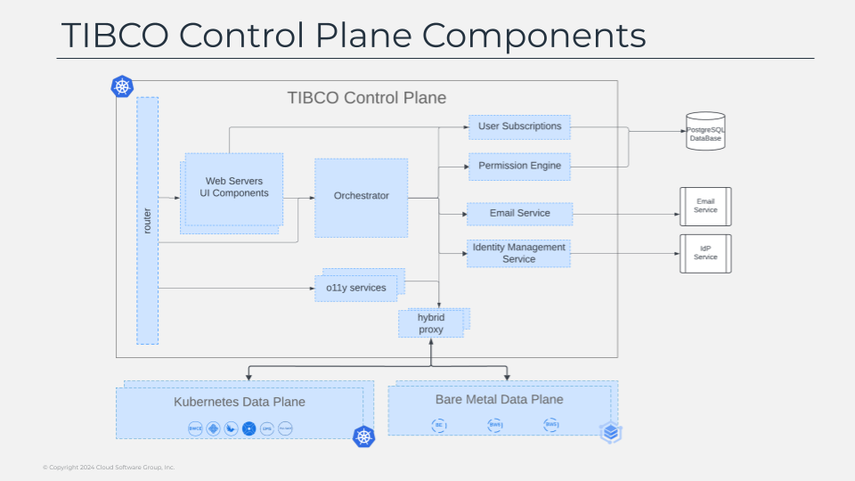

# Control Plane - Data Plane Communication

Control plane as already commented is the single pane  for all the activities we do with tibco platform, it will allow us to see everything is that happening across all of our tibco workloads and act on that as required from provisioning new resources such as new messaging services or deploying new applications and so on.

The high-level logical components that are part of the tibco control plane are the ones that you see in this diagram on the screen:.

All requests that are coming from the outside are handled by the router that will be the component to define which is the best component to fulfill the required action being requested.

- Web server component will provide all the different ui aspects for the core parts of the control plane as long as each of the different capabilities handled by it.

- Orchestrator as it names already suggest is the component responsible to orchestrate the fulfill of the request across the different services that part of the platform and it will have the support of several services to do part of the job:.

- Permission engine and user subscriptions will ensure that the user has the right permission to the job, and the action.

- Identity management will allow the integration with the corporate idp to handle the single-sign-on process in the control plane.

- Email service will handle any email notifications to the tibco platform users where required.

- O11y-services covers all the services regarding retrieving and managing the observability data in control plane.

- hybrid proxy handle the communication with the different data planes in a secure way, but we will talk much more on detail on that when talk about the data plane composition and architecture.

