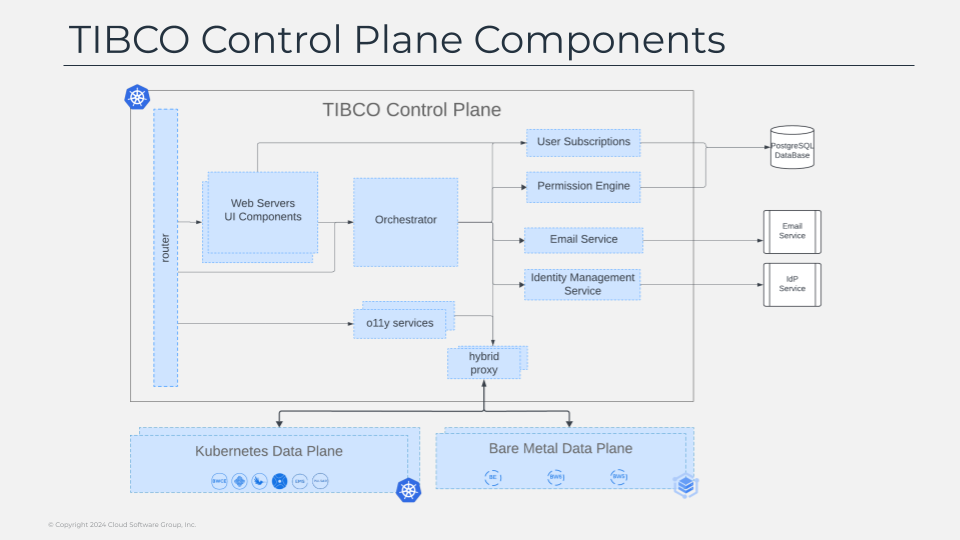

# Control Plane - Data Plane Communication

As commented some of the main responsibilities of this helper components include the communication aspect to the control plane, and as we already explain the control plane can reside on your premises in a self-hosted model or in the cloud in a more saas model so the security of that communication is critical for all of our customers. 

So, how do we ensure the communication between data plane and control plane is secured? first of all, we make sure that all communication starts always from the data plane, so in that case we avoid the situation to need to open any kind of port from the outside to be reached that could lead to an open point from security perspective. so this is the job that the tibtunnel does. as its name already suggest help create a tunnel between the data plane and the control plane to receive once established all the requests that are coming from the control plane, once the requests are sent through the tunnel the component that receives it is the cpdp proxy that is the one responsible for route that request to the component in the data plane that needs to fulfill that requests. 

It could be request related to provisioning a new capability or to perform a specific operation like deploying a new businessworks application, or it can be also calls to retrieving observability data to populate the single pane of glass in the control plane. so with the work of those components we handle the communication that goes from the control plane to the data plane, but there is other communication that goes on the other way. 

It is initiated in the data plane and need to be reach to the control plane. for that we have another component named cp-proxy that do that works is the responsible to handle the secure communication of all the requests that are initiated in the data plane. some example of that could be the monitoring status of the components. 

For the control plane to knows how the status are performing in the kubernetes environments it receives informations that is periodically generated by the data plane helper components and send through that flow we already explain and can be seen in the diagram in front of you. but let’s take a look more in detail about other of the process that is done inside the data planes, the provisioning of capabilities and features.

