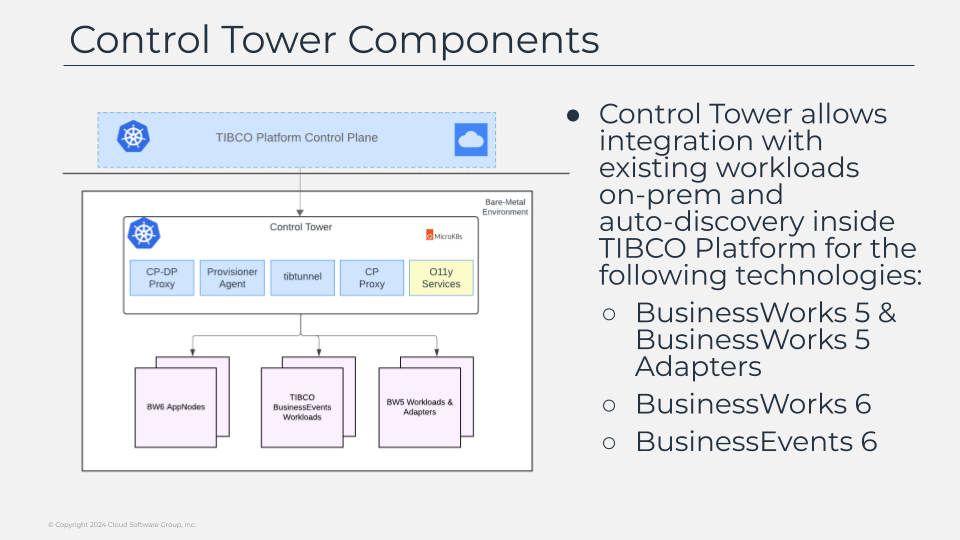

# Control Tower Components

With all of that we do a good overview about the components and the behavior of them in a pure cloud-native data plane, but not only about cloud-native lives our architectures as the existing on-premises integration layers are also critical for the well behavior of our enterprises. and here is where the control tower takes place. 

Control tower is the component that enable the communication and features to the bare-metal data planes integrating the control plane with your existing bw5 hawk domains or bw6 agent networks or your tibco businessevents applications. 

As you can see in the  screen the composition of the bare-metal data plane is very much similar as the kubernetes one, there is a set of helper components most of them similar to the ones we already described and we have the capabilities where our workloads run, but in this case this capabilities are externally located in our classic tibco stacks.

There will be additional components on that layer because of the nature of the workloads that manage such has a hawk agent to enable to integration with the existing hawk domains for your workloads or a bw6 adapter to be able to integrate with the existing agent networks to gather all the information and transmit any action that could be required.

