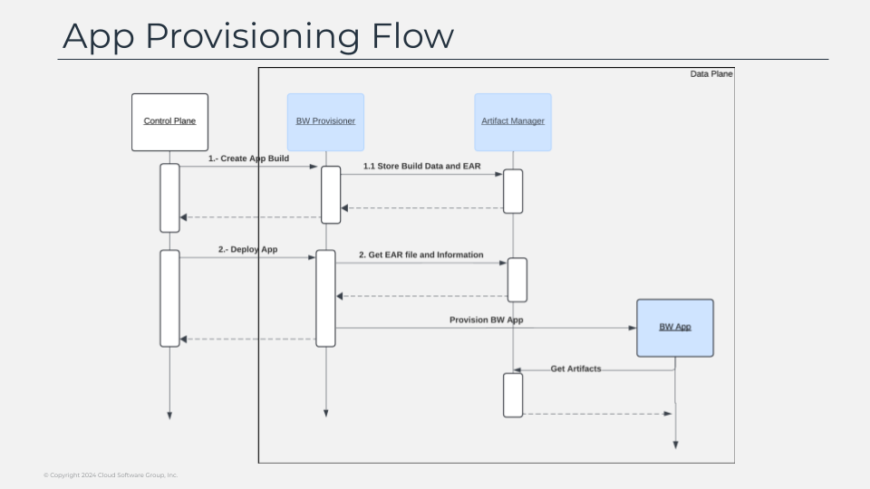

# App Provisioning Flow

One important point of the flow is the provisioning of an app, as this will be something you will be doing very often once engaged with the platform. as commented the key component on that is the provisioner of the capability that it will provide this common interface that provides all the options that you can have for an application. to deploy an application on the platform as you probably already know you will need to create first an application build, that will include your deployment artifact, your ear file in case of buinessworks developments plus a set of metadata that is required to be able to do the provisioning. 

This metadata includes things like: which bw version you want to deploy this application with or which kind of plugins needs to be provision with this application. all that information is stored on the previously described artifact manager so it can be leverage in later actions. then, once your build is created you can perform the deployment action. here is where you said the build you want to deploy to this data plane, the specific configuration this application has, the public endpoints, scalability configuration and any other technical aspect that impacts on the deployment for the app. and the provisioner with that information and after gathering the data in the artifact manager to create a bw application with that configuration. 

The application created won’t contain the ear file or the deployments, those components will be provisioning on the fly when the application starts. as part of the startup will gather the ear file and the plugins to be provisioning and installing it as part of the initialization process, keeping simple the container image management flow, as most of the application will share the same container image depending on the bw version we’re running our application against.

