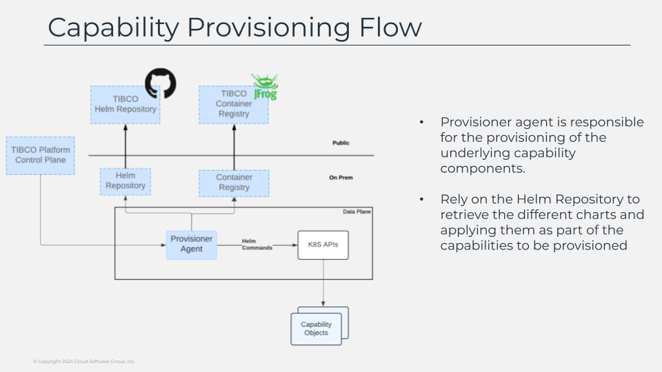

# Capability Provisioning Flow

Provisioning of the capabilities is one of the main flows that the data plane will perform. capabilities can be provision at any moment since the inception of the data plane, so in that way the tibco platform follows an extensible approach where you can start with a single capability, for example your businessworks workloads and soon as you need more capabilities like for example messaging capabilities in that moment you can add it to an existing data plane. 

Also the other way is supported, when you don’t require a capability you can also remove it from your data plane what in the end provides you all the flexibility in your hands adjusting your architecture and evolving at the same time your needs are.  

So, in this case we’re going to omit the network related thing as we already explained in the past slide and focus on the logic flow. all the provisioning work is performed by a single component that exists in the data plane named “provisioner-agent”. 

So as the name already suggests is an agent that is responsible for the provisioning. and how that works? the provisioner agent receives a request from the control plane with the detail of what needs to be provisioning based on what we call a recipe that is the kind of steps that needs to be taken in consideration to do the work. 

That includes the helm charts to install, the configuration of those, and as always as any additional activity that could be required.  Once the provisioner agent has the request is contacts the helm repository to gather the charts to be installed and depending on your deployment model this helm charts can reside on a public site like the github page repository where we publish the version of the charts or it can be of any other repository for helm chart of your choice. 

And with all that info create the required helm releases and configuration steps are configured to make that recipe a reality in the data plane sharing the status of that process with the control plane, so it can inform the user from the ui directly without the need to take a look at the kubernetes cluster at hand.

