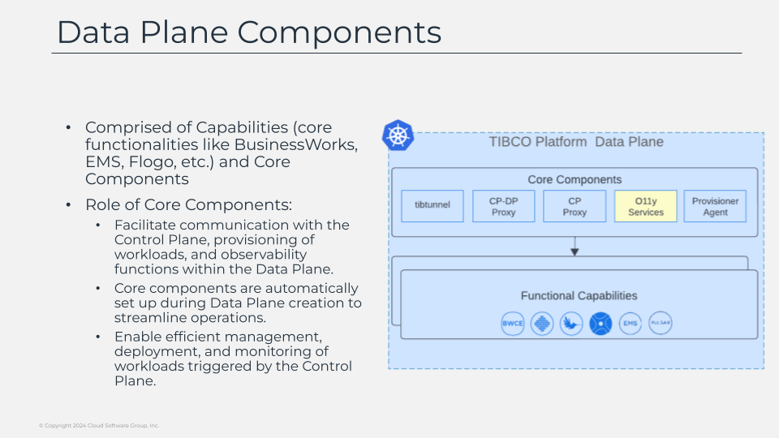

# Data Plane Components

Helpers are lightweight components that supports a features that the data plane provides. some of the handle the communication with the control plane, another handle the provisioning of the work that is being sent by the control plane and others handled the observability aspect of the data plane. all of this helpers component are automatically provisioned when the data plane is created. so let’s talk a little bit more in detail about the work that they do.

