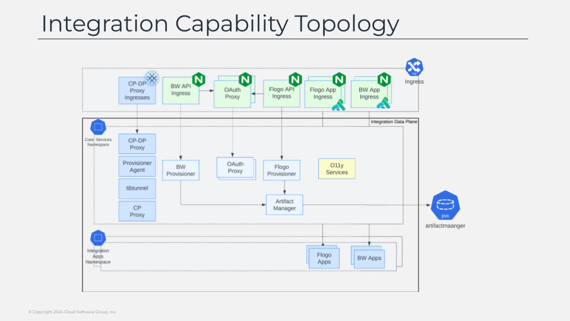

# Integration Capability Topology

Now, we are going to take a look at the deployment model of one of this capabilities that are running inside a data plane and we’re going to see the integration ones as you can see in the diagram in the screen, as you can see there are again two different kind of components: the integration apps, our well known bw and flogo application running in its own namespaces and implementing the business logic. 

And the helper components are responsible for doing the provisioning flow of those application as well as provide the common features such as observability. as it can be seen in the screen we will have a provisioner that is responsible for the actions to be performed on the functional application: deploy a new application, update the application, change the auto scalability configuration or the visibility of the endpoints. 

In a nutshell is the responsible of any action you could think about regarding the application. that leverage an artifact manager component that stores the metadata and the artifacts for each of the applications to be deploy.  

Here will be all the plugins and connectors that are being provisioned and it could be required for the application, and also the ear files or json files for the flogo applications to be deployed on top of the container images when a new application is deployed. 

Each of this provisioner also exposes an api secured through a oauth2proxy component that allow to automate all the work that can be done through the control plane ui to enable automation flows of any kind. finally we will have also the observability components that are responsible to provide the observability features to the workloads.

