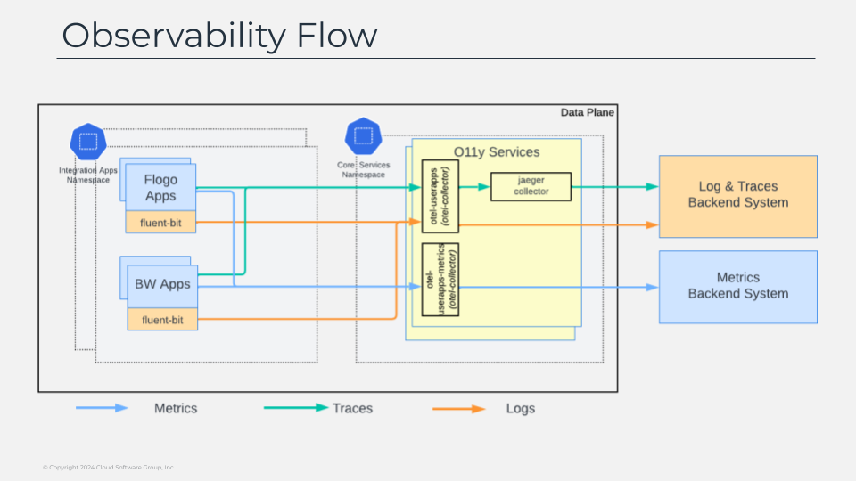
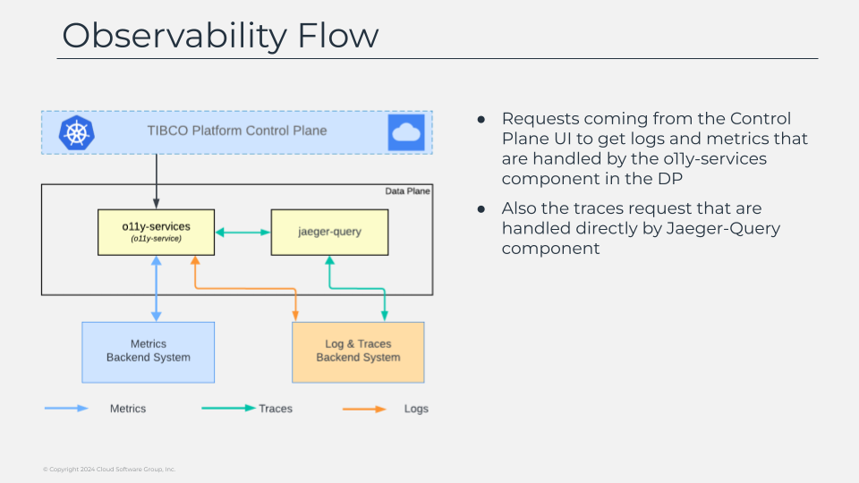

# Observability Flow

Each of the integration app will integrate those observability components to handle the different pillars of the observability. each of the application will have a fluent-bit sidecar responsible for doing the aggregation of the logs through an otel-collector that will define the backend where all this information it will be stored. also if of the application will use the opentelemetry format to share the metrics and traces for the application that the different opentelemetry collectors will make available to jaeger components to handle the tracing data and prometheus to handle the metrics data out of it.

But as commented the data not only need to be sent from the applications to the backend your storing that information, as the observability data always reside on the customers hands no matter if you follow a saas deployment model from the control plane or a self-hosted one. 

So that requires also a mechanism to be able to retrieve that information back and we do that with the help of one components name o11y-service that receives the request from the control plane and gathering the information from the backend components it will gather that information to shared with the control plane to populate the observability pane on the ui. 

Depending on the information we’d like to retrieve we will go directly to the backend as we do for logs or metrics and for traces we leverage the jaeger component to perform that job.

